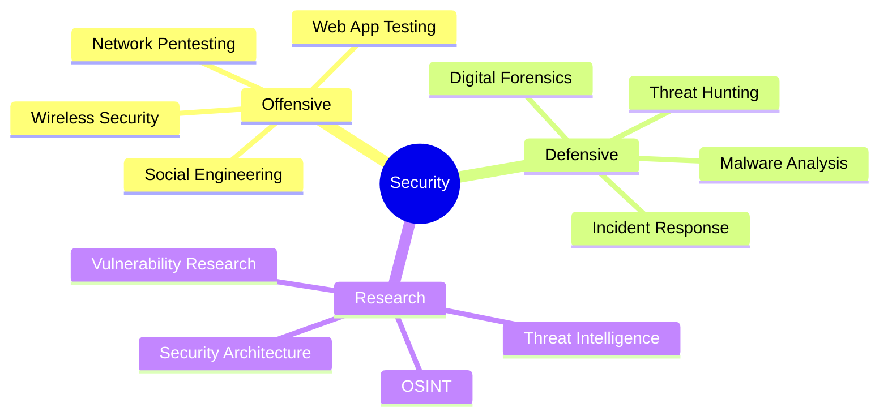

<div align="center">

# 🛡️ **CwlTF**

**`Penetration Tester • Digital Forensics Specialist • Security Researcher`**

</div>

-----

## 🎯 **About**

Cybersecurity professional specializing in **offensive security** and **digital forensics**. Passionate about discovering vulnerabilities, analyzing digital evidence, and strengthening organizational security posture through comprehensive assessments and incident response.

```yaml
current_role: "Security Consultant"
specializations:
  - Penetration Testing
  - Digital Forensics & Incident Response
  - Malware Analysis
  - Threat Hunting
  - Security Architecture Review
focus_areas:
  - Web Application Security
  - Network Infrastructure Assessment  
  - Memory Forensics
  - Cloud Security
```

-----

## 🔧 **Technical Stack**

<div align="center">

### **Penetration Testing**


### **Digital Forensics**


### **Programming & Scripting**


</div>

-----

## 📈 **GitHub Analytics**

<div align="center">


</div>

-----

## 🔬 **Core Competencies**

<table>
<tr>
<td width="50%">

### **🚨 Offensive Security**

- Web Application Penetration Testing
- Network Infrastructure Assessment
- Wireless Security Testing
- Social Engineering Campaigns
- Red Team Operations
- Vulnerability Research & Exploitation

</td>
<td width="50%">

### **🔍 Digital Forensics**

- Incident Response & Investigation
- Memory & Disk Forensics
- Network Traffic Analysis
- Mobile Device Forensics
- Malware Analysis & Reverse Engineering
- Timeline Analysis & Evidence Correlation

</td>
</tr>
</table>

-----

## 🎖️ **Certifications & Training**

<div align="center">

|Certification|Status     |Focus Area         |
|-------------|-----------|-------------------|
|🏴‍☠️ **OSCP**   |Active     |Penetration Testing|
|🛡️ **CEH**    |Active     |Ethical Hacking    |
|🔍 **GCFE**   |Active     |Computer Forensics |
|🚨 **GCIH**   |Active     |Incident Handling  |
|⚡ **CISSP**  |In Progress|Security Management|

</div>

-----

## 🎯 **Current Projects**

```bash
$ ls -la ~/active_research/

drwxr-xr-x  forensics-automation-suite/     # Python toolkit for automated evidence analysis
drwxr-xr-x  web-vuln-scanner/               # Custom web application vulnerability scanner
drwxr-xr-x  memory-analysis-toolkit/        # Advanced memory forensics utilities
drwxr-xr-x  osint-framework/                # Open source intelligence gathering tools
drwxr-xr-x  threat-hunting-playbooks/       # Threat detection methodologies
```

-----

## 📚 **Knowledge Areas**

<div align="center">



</div>

-----

## 🌟 **Recent Achievements**

- 🏆 Identified critical vulnerabilities in enterprise web applications
- 🔍 Led forensic investigations for major security incidents
- 📝 Published research on advanced persistent threat detection
- 🎯 Developed automated tools for forensic evidence collection
- 🚀 Contributed to open-source security projects

-----

## 💬 **Let’s Connect**

<div align="center">

[](mailto:contact@example.com)
[](https://linkedin.com/in/your-profile)
[](https://twitter.com/your-handle)
[](https://your-blog.com)

**Always open to discussing cybersecurity, sharing knowledge, and collaborating on security research.**

</div>

-----

<div align="center">

### 🔐 *“Security is not a product, but a process”* 🔐


</div>
